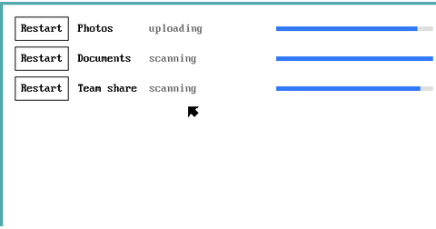

# vero

**Go backend with native cross-platform GUI frontends.  Build on macOS, run anywhere Go runs.**

Run a Go binary embedded in a native (e.g. macOS SwiftUI) app. The Go binary and the native (e.g. SwiftUI) app communicate over a pipe (an OS pipe or io.Pipe depending on the operating system).  

[](https://pkg.go.dev/github.com/imclaren/vero)

[Build and run the macOS example](#build-and-run-the-macos-example) ·
[Create a vero macOS app](#create-a-vero-macos-app) ·
[Build and run the example on all platforms using your Mac](#build-and-run-the-example-on-all-platforms-using-your-mac) ·
[Creating app installers](#creating-app-installers) ·
[Taking your app to more platforms](#taking-your-app-to-more-platforms)

| Operating system | Example | Required on your Mac to build and run | Build and run on your Mac |
|---|:---:|---|---|
| **macOS** — **`darwin/amd64`**, **`darwin/arm64`** | <a href="#build-and-run-the-macos-example"></a> | Xcode, from the App Store. Run [`setup-macos.sh`](scripts/setup-macos.sh) to check that Xcode has been installed | Builds and runs. SwiftUI, in the menu bar, built by running [`example/menubar-app/build.sh`](example/menubar-app/build.sh).<br><br>If you already have Xcode and Go installed, the [macOS example](#build-and-run-the-macos-example) below builds a running app. |
| **Windows** — `windows/386`, **`windows/amd64`**, **`windows/arm64`** | <a href="example/wpf-app"></a> | qemu, the .NET SDK and a Windows 11 ARM64 ISO, which can be installed by running [`setup-windows.sh`](scripts/setup-windows.sh) | Builds and runs. WPF, started in a Windows VM by running [`scripts/run-windows.sh`](scripts/run-windows.sh). |
| **Linux** — `linux/386`, **`linux/amd64`**, `linux/arm`, **`linux/arm64`**, `linux/loong64`, `linux/mips`, `linux/mips64`, `linux/mips64le`, `linux/mipsle`, `linux/ppc64`, `linux/ppc64le`, `linux/riscv64`, `linux/s390x` | <a href="example/gtk-app"></a> | Docker and colima, which can be installed by running [`setup-linux.sh`](scripts/setup-linux.sh) | Builds and runs. GTK4, started in a Docker container by running [`scripts/run-linux.sh`](scripts/run-linux.sh). |
| **FreeBSD** — `freebsd/386`, **`freebsd/amd64`**, `freebsd/arm`, **`freebsd/arm64`** | <a href="example/gtk-app"></a> | qemu, which can be installed by running [`setup-freebsd.sh`](scripts/setup-freebsd.sh) | Builds and runs. GTK4, the same app as Linux, NetBSD and OpenBSD, started in a VM by running [`scripts/run-freebsd.sh`](scripts/run-freebsd.sh). |
| **OpenBSD** — `openbsd/386`, **`openbsd/amd64`**, `openbsd/arm`, **`openbsd/arm64`**, `openbsd/ppc64`, `openbsd/riscv64` | <a href="example/gtk-app"></a> | qemu, which can be installed by running [`setup-openbsd.sh`](scripts/setup-openbsd.sh) | Builds and runs. GTK4, the same app as Linux, FreeBSD and NetBSD. OpenBSD ships an installer rather than a disk image, so the first run installs it, answering `autoinstall(8)` from a response file: [`scripts/run-openbsd.sh`](scripts/run-openbsd.sh). |
| **NetBSD** — `netbsd/386`, **`netbsd/amd64`**, `netbsd/arm`, **`netbsd/arm64`** | <a href="example/gtk-app"></a> | qemu, which can be installed by running [`setup-netbsd.sh`](scripts/setup-netbsd.sh) | Builds and runs. GTK4, the same app as Linux, FreeBSD and OpenBSD, started in a VM by running [`scripts/run-netbsd.sh`](scripts/run-netbsd.sh). |
| **DragonFly** — **`dragonfly/amd64`** | <a href="example/gtk-app"></a> | qemu, which can be installed by running [`setup-dragonfly.sh`](scripts/setup-dragonfly.sh) | Builds and runs. GTK4, the same app as the other BSDs, started in a VM by running [`scripts/run-dragonfly.sh`](scripts/run-dragonfly.sh). DragonFly is x86 only, so that VM is emulated rather than virtualised: a minute to boot, and an hour to install GTK4 the first time. |
| **illumos** — **`illumos/amd64`** | <a href="example/gtk-app"></a> | qemu, which can be installed by running [`setup-illumos.sh`](scripts/setup-illumos.sh) | Builds and runs. GTK4, the same app as the BSDs, on OpenIndiana in a VM: [`scripts/run-illumos.sh --install`](scripts/run-illumos.sh) installs it, which takes about an hour because illumos is x86 only and this Mac emulates that, and `run-illumos.sh` runs it afterwards. |
| **Android** — `android/386`†, `android/amd64`†, `android/arm`†, **`android/arm64`** | <a href="example/android-app"></a> | the Android SDK, a JDK and Kotlin, which can be installed by running [`setup-android.sh`](scripts/setup-android.sh) | Builds and runs in the emulator, built and started by running [`scripts/run-android.sh`](scripts/run-android.sh). |
| **iOS** — `ios/amd64`†, **`ios/arm64`** | <a href="example/ios-app"></a> | Xcode and a Simulator runtime, which can be installed by running [`setup-ios.sh`](scripts/setup-ios.sh) | Builds and runs in the Simulator, not on a phone. An app may not start a program on iOS, so the worker is compiled into the app and runs on a goroutine. Built and launched by running [`scripts/run-ios.sh`](scripts/run-ios.sh). |
| **wasm**, a browser — **`js/wasm`** | <a href="example/web-app"></a> | a browser | Builds and runs. A page may not start a program, so the worker is compiled into the same wasm as the UI, as on iOS. Built and opened by running [`scripts/run-web.sh`](scripts/run-web.sh). |
| **wasm**, WASI — **`wasip1/wasm`** | <a href="example/wasi-app"></a> | wasmtime, which can be installed by running [`setup-wasm.sh`](scripts/setup-wasm.sh) | Builds and runs, as [example/wasi-app](example/wasi-app): your Go program starts `wasmtime`, which runs `worker.wasm`. It has to be a Go program, because the Python, C# and Kotlin bindings would ask `worker.wasm` to start a second copy of itself, which it cannot do in a sandbox. Note too that `worker.wasm` answers one request at a time, and can do nothing in between. |
| **Plan 9** — `plan9/386`, **`plan9/amd64`**, `plan9/arm` | <a href="example/plan9-app"></a> | qemu, which can be installed by running [`setup-plan9.sh`](scripts/setup-plan9.sh) | Builds and runs. The same three rows drawn with libdraw in a rio window, started in a VM by running [`scripts/run-plan9.sh`](scripts/run-plan9.sh); `--test` runs vero's test suite there instead. Plan 9 is x86 only, so the VM is emulated. We also had to fix the Go libdraw it uses because it did not build for Plan 9 until [9fans/go#147](https://github.com/9fans/go/pull/147), so the example pins our fork carrying that fix. |
| **Solaris** — **`solaris/amd64`** | — | — | Builds by running [`scripts/build-all.sh`](scripts/build-all.sh), and does not run. Oracle Solaris needs an Oracle account and licence to download, and runs on x86, which this Mac emulates rather than virtualises. Oracle's repository ships GTK 3, not GTK 4, so the GTK example would not run there as written; the worker and vero's tests would work. |
| **AIX** — **`aix/ppc64`** | — | — | Builds by running [`scripts/build-all.sh`](scripts/build-all.sh), and does not run. There is no public AIX media: IBM provides it only under entitlement, with POWER hardware. qemu can emulate `pseries`, but there is nothing to boot on qemu. |

## Build and run the macOS example

The example is a menu bar app driving the Go worker (main.go below):

```bash
git clone https://github.com/imclaren/vero && cd vero
cd example/menubar-app && ./build.sh
./.build/debug/MenuBarExample
```

Look for the icon in the menu bar. The source is available at
[example/menubar-app](example/menubar-app).

## Create a vero macOS app

### 1. Build the go worker

Get vero:

```bash
mkdir -p ~/vero-example/macos-app && cd ~/vero-example/macos-app
go mod init macos-app
go get github.com/imclaren/vero
```

Create `main.go` (file also available at
[example/worker/main.go](example/worker/main.go)):

```go
// Command worker is the logic half of the example: the part you would write.
//
// The flags come from vero.WorkerOptions: -json puts the event stream on
// stdout, -quiet silences the log, and -version is what the frontend asks
// before replacing the copy of this it has on disk.
package main

import (
	"flag"
	"fmt"
	"math/rand"
	"slices"
	"time"

	"github.com/imclaren/vero"
)

// version has to increase on every release, so the frontend can tell which
// of two copies is newer.
var version = "0.13.0"

type Job struct {
	ID       int    `json:"id"`
	Name     string `json:"name"`
	Phase    string `json:"phase"`
	Progress int    `json:"progress"`
}

// Key is how an id in a request finds one job.
func (j Job) Key() int { return j.ID }

func (j *Job) Restart() { j.Phase, j.Progress = "waiting", 0 }

type Status struct {
	Jobs    []Job  `json:"jobs"`
	Working bool   `json:"working"`
	Since   string `json:"since"`
}

func working(s *Status) {
	s.Working = slices.ContainsFunc(s.Jobs, func(j Job) bool {
		return j.Phase != "waiting" && j.Phase != "done"
	})
}

func main() {
	var opts vero.WorkerOptions
	opts.Version = version
	opts.RegisterFlags(flag.CommandLine)
	flag.Parse()
	opts.PrintVersionAndExit()

	w := vero.NewWorker(opts)

	// The state.  vero watches it and sends it to the frontend whenever its
	// JSON changes, which is how the frontend tracks status without asking.
	// Each handler below replies with it as well.
	state := vero.NewState(w, Status{
		Jobs: []Job{
			{ID: 1, Name: "Photos", Phase: "waiting"},
			{ID: 2, Name: "Documents", Phase: "waiting"},
			{ID: 3, Name: "Team share", Phase: "waiting"},
		},
		Since: time.Now().Format("15:04:05"),
	})

	go work(w, state)

	// Update handles a request with no accompanying data.  "status" returns
	// the state.
	vero.Update(state, "status", func(*Status) error { return nil })

	// UpdateWith handles a request with accompanying data.  "restartJob"
	// takes the id of the job to restart.
	vero.UpdateWith(state, "restartJob", func(s *Status, req vero.ID[int]) error {
		if err := vero.Edit(s.Jobs, req.ID, (*Job).Restart); err != nil {
			return fmt.Errorf("no job with id %d", req.ID)
		}
		working(s)
		return nil
	})

	if err := w.Serve(); err != nil {
		w.Log("stopped: %v", err)
	}
}

// work is the business logic - we have added random state changes to
// demonstrate how this works.
func work(w *vero.Worker, state *vero.State[Status]) {
	phases := []string{"looking for changes", "scanning", "uploading", "done"}
	for {
		time.Sleep(time.Duration(200+rand.Intn(400)) * time.Millisecond)

		var name, phase, before string
		state.Do(func(s *Status) {
			j := &s.Jobs[rand.Intn(len(s.Jobs))]
			before = j.Phase
			switch i := slices.Index(phases, j.Phase); {
			case j.Phase == "waiting" || j.Phase == "done":
				j.Phase, j.Progress = phases[0], 0
			case j.Progress < 100:
				j.Progress = min(j.Progress+20+rand.Intn(30), 100)
			case i+1 < len(phases):
				j.Phase, j.Progress = phases[i+1], 0
			}
			name, phase = j.Name, j.Phase
			working(s)
		})

		if phase != before {
			w.Log("%s: %s", name, phase)
		}
	}
}
```

Build it for both architectures (old Intel Macs and new Apple Silicon Macs) and join them into one binary, so the app runs
on either. `lipo` comes with Xcode:

```bash
GOOS=darwin GOARCH=amd64 go build -o worker-amd64 . && \
GOOS=darwin GOARCH=arm64 go build -o worker-arm64 . && \
lipo -create worker-amd64 worker-arm64 -output worker
```

### 2. Create a new macOS SwiftUI Xcode project

In Xcode, File -> New -> Project -> macOS -> App, with Interface set to
SwiftUI. Then:

- File -> Add Package Dependencies... -> `https://github.com/imclaren/vero`
- drag `~/vero-example/macos-app/worker` into the project, ticking your app
  under **Add to targets**

### 3. Add the app to the project

Create `ExampleApp.swift` (file also available at
[example/menubar-app/Sources/MenuBarExample/ExampleApp.swift](example/menubar-app/Sources/MenuBarExample/ExampleApp.swift)):

```swift
import SwiftUI
import Vero

// What the worker pushes: the same shape as Status and Job in main.go.
struct Job: Decodable, Identifiable {
    let id: Int
    let name: String
    let phase: String
    let progress: Int
}

struct Status: Decodable {
    let jobs: [Job]
    let working: Bool
    let since: String
}

// One of these per handler on the worker. The name routes the request -
// "restartJob" is the vero.UpdateWith above - and Reply says what comes back,
// so nothing has to guess at it.
struct RestartJob: NamedRequest {
    static let name = "restartJob"
    typealias Reply = Status
    let id: Int
}

@main
struct ExampleApp: App {
    // One copy at a time. A second one - opened from Downloads while the one
    // in Applications is running, say - would be refused the worker and sit
    // there with nothing to show, so it brings the first forward and quits.
    init() { VeroSingleCopy.yieldToRunningCopy() }

    // The worker, the last state it pushed, and the reason it could not start
    // if it did not: everything a view needs to draw, created once, here.
    @StateObject private var vero = VeroModel<Status>(
        bundledWorker: "worker", directoryName: "Example/bin")

    var body: some Scene {
        MenuBarExtra {
            VStack(spacing: 10) {
                ForEach(vero.state?.jobs ?? []) { job in
                    HStack(spacing: 10) {
                        // The press. This goes to the "restartJob" handler in
                        // main.go. There is no reply to deal with here,
                        // because the worker pushes the new state, and that
                        // is what redraws the row.
                        Button("Restart") { vero.call(RestartJob(id: job.id)) }
                        Text(job.name)
                        Text(job.phase).foregroundStyle(.secondary)
                        ProgressView(value: Double(job.progress) / 100)
                    }
                }
            }
            .frame(width: 460)
            .padding(16)
        } label: {
            // Pushed as well, so the icon spins while the worker is busy
            // without anything here asking it whether it is.
            Image(systemName: vero.state?.working == true
                  ? "arrow.triangle.2.circlepath"
                  : "checkmark.circle")
        }
        .menuBarExtraStyle(.window)
    }
}
```

Delete the `ContentView.swift` and `<YourApp>App.swift` that Xcode generated:
`ExampleApp.swift` is the `@main` entry point.

### 4. Run it

Press Cmd-R in Xcode. The icon appears in the menu bar, and spins while the
worker has jobs in flight. Click the menu bar icon to see progress changes.
Click the button on a row to restart that job.

## Build and run the example on all platforms using your Mac

[`./scripts/setup.sh`](scripts/setup.sh) installs the build prerequisites for
all platforms. Only two things are not installed for you using this script:
Xcode, which comes from the App Store, and a Windows ISO, which Microsoft
will not serve to a script - download it from
[https://www.microsoft.com/en-us/software-download/windows11arm64](https://www.microsoft.com/en-us/software-download/windows11arm64)
and put it in `~/vm/vero-windows/`.

[`./scripts/run.sh`](scripts/run.sh) then builds and opens the example on macOS (natively), and Linux
and Windows (by showing the app in VMs) side by side.

All targets in **bold** (e.g. `darwin/arm64`), other than `android/arm64`,
`ios/arm64` and `js/wasm`, can be built by running
[`./scripts/build-all.sh`](scripts/build-all.sh).
[`android/arm64`](example/android-app/build.sh),
[`ios/arm64`](example/ios-app/build.sh) and
[`js/wasm`](example/web-app/build.sh) have their own build scripts because
they do not build a standalone worker. To build targets not in bold, specify
them when building: `TARGETS=plan9/386 ./scripts/build-all.sh`.

† targets need a C toolchain: either an NDK for the three Androids that are
not `arm64`, or the Simulator SDK for `ios/amd64`. The other 43 targets only
need Go.

## Creating app installers

vero builds your app's installers, and the website your users install
them from and get updates from. You describe your app once, in a file
called `vero-app.toml`. vero then makes the installers, and a folder of
plain files to put on any web host. It holds a page telling people how to
install your app on their system, signed repositories that their systems
update from, and the downloads.

A release never needs a virtual machine, a container or anything but your
Mac: the one exception is a Flatpak, which needs Docker and is made only
if you ask for it. vero's own tests, below, do use VMs and containers, to
check that each system installs and updates from a site; you don't have to
run them.

| System | What your users get | What you need on your Mac |
|---|---|---|
| Debian, Ubuntu | an apt repository: install once, then their usual updates | Go |
| Fedora, openSUSE | an rpm repository, the same | Go |
| Arch Linux | a recipe for the AUR | Go |
| Any Linux, with Flatpak | a Flatpak repository, if you ask for one | Docker and colima |
| FreeBSD, DragonFly | a pkg repository | Go |
| NetBSD, illumos | a pkgsrc repository, for pkgin | Go |
| OpenBSD | signed packages for pkg_add | Go |
| macOS | a disk image, a Sparkle appcast for updates, and a Homebrew cask | Xcode; a Developer ID and an Apple account to notarise |
| Windows | an installer, and a winget manifest; an MSIX for the Microsoft Store if you ask | makensis and dotnet |
| Android | a signed .apk, and an .aab for Google Play if your build makes one | the Android SDK and a JDK |
| iPhone and iPad | an .ipa, for the App Store or TestFlight | Xcode and an Apple account |
| In a browser | the page, served from the site | Go |
| In a terminal, with WASI | bundles for each desktop, whose worker is one worker.wasm | Go |
| Plan 9 | a bundle with an install script | Go |

Each row is made when `vero-app.toml` has its section. What the table
calls Go is Go alone: vero's packaging tool, `vero-repo`, makes every
package, repository, signature and index itself.

### Try it on the example

vero's example describes itself in
[`example/vero-app.toml`](example/vero-app.toml), with a section for
every one of its front ends. From vero's folder, this builds its
installers into `dist/packages`, then its site into `dist/site`:

```bash
scripts/package.sh --app example/vero-app.toml --version 1.0.0
(cd cmd/vero-repo && go install .)
vero-repo key --name "Example Publisher" --email you@example.com --dir ~/.cache/vero/example-key
vero-repo build --app example/vero-app.toml --key ~/.cache/vero/example-key --url https://example.com/vero-example
```

`go install` puts `vero-repo` in Go's `bin` folder, which needs to be on
your `PATH`. `vero-repo key` won't replace a key it made before, so the
next time, start from `vero-repo build`. Use `--targets` to build only
some systems, which is handy on a Mac without the Android SDK, say:
`scripts/package.sh --app example/vero-app.toml --version 1.0.0 --targets deb,macos`.

[`scripts/test-repo.sh`](scripts/test-repo.sh) checks all of it for real.
It builds the example's site, serves it from your Mac, and installs the
example from it on a clean system, as the site tells people to. Then it
releases version 1.0.1 and checks that the system's own updates bring it.
It tries Debian, in a container, unless you say otherwise:

```bash
scripts/test-repo.sh --image ubuntu:24.04
scripts/test-repo.sh --image fedora:latest
scripts/test-repo.sh --image opensuse/tumbleweed
scripts/test-repo.sh --image archlinux
scripts/test-repo.sh --flatpak
scripts/test-repo.sh --vm freebsd         # also netbsd, openbsd, dragonfly, illumos
scripts/test-repo.sh --mac                # the disk image, on this Mac, and the appcast after an update
scripts/test-repo.sh --vm windows         # the installer and the MSIX, in vero's Windows VM
```

The containers need Docker and colima. A `--vm` test uses the system's VM,
which its `run-*.sh` script makes the first time; that downloads the
system and its GTK, a few gigabytes. The Windows VM has no way in but a
disc and no way out but its screen, so that test leaves a screenshot of
its results for you to read.

### Your own app

Run these from your app's folder, the one with its `go.mod`.

**1. Describe your app.** Copy
[`example/vero-app.toml`](example/vero-app.toml) beside your `go.mod`, and
change it to describe your app. The comments in it explain each setting.
Paths in it are relative to the file. Your worker's main package needs a
`var version`, which the build sets.

Each system names its packages differently, so `vero-app.toml` says what
your app needs from each, in its own section: `[gtk.deb]`, `[gtk.rpm]`,
`[gtk.arch]`, `[gtk.freebsd]` and so on. Leave out the sections of the
systems you don't want; a system is packaged for only when its section is
there. `[needs]` says what the app asks of the system, such as the
network.

**2. Make a signing key, once.**

```bash
vero-repo key --name "Your Name or Company" --email you@example.com
```

This makes a folder in `~/.config/vero-repo`. Its `private.asc` signs every
release, so that people's systems can tell your updates are really yours;
`signify.sec` signs the OpenBSD packages; `sparkle.sec` signs Mac updates;
and `android.keystore`, made the first time an Android app is built, signs
it. Back the folder up, keep it out of your repository, and never publish
anything in it but `key.asc`, the public half, which your site publishes.

If your Mac app already updates itself with Sparkle, keep its key, so that
copies already installed go on updating: `vero-repo key --dir DIR
--import-sparkle FILE`, where FILE holds the private key Sparkle's
`generate_keys -x` exported. Older Sparkle keys, which were kept
expanded rather than as a seed, are taken too.

**3. Build the installers.**

```bash
path/to/vero/scripts/package.sh --app vero-app.toml --version 1.2.3
```

This builds them into `dist/packages`, each for both x86_64 and ARM64
processors where the system has both. Use `--targets` to build only some
of them: `deb`, `rpm`, `flatpak`, `freebsd`, `dragonfly`, `netbsd`,
`illumos`, `openbsd`, `macos`, `windows`, `msix`, `android`, `ios`, `web`,
`wasi`, `plan9`; or `linux` for the `.deb` and `.rpm`, and `bsd` for the
BSDs and illumos. Use `--ldflags` to build more into your worker, such as
API keys from a file outside your repository.

**4. Build the site.**

```bash
vero-repo build --app vero-app.toml --key ~/.config/vero-repo/your-name-or-company \
    --url https://example.com/myapp
```

This builds the site into `dist/site`. `--url` is where the site will be,
because the commands on its page and its repositories need to know. At the
end, `build` checks the site as `vero-repo check` would: that every
signature verifies with the keys the site publishes, that every index's
sizes and hashes match its files, that every link and manifest points at
a file that's there, that each package holds your worker and front end,
and that no system's version has gone backwards, which would leave people
never offered the update. It refuses to finish otherwise.

**5. Put it online.** Upload the contents of `dist/site` to any static web
host, so that they appear at the `--url` you gave. Then send people to
that address, where the page shows the commands for their system first.

**6. Release an update.** Change your version, then repeat steps 3 to 5,
building into the same `dist/site`. vero keeps the three newest versions
of each installer; use `--keep` to change that. People get the update
with their usual updates: apt, dnf, zypper, pkg, pkgin and Flatpak find it
by themselves, a Mac app with Sparkle reads the appcast, and OpenBSD's
`pkg_add -u` does with the folder the page says to give it. On Arch, they
build the recipe again. Your app can read `latest.json` from the site to
tell Windows and Android users that a new version is out.

### macOS

`[macos]` names a SwiftPM package (`folder` and `product`) or an Xcode
project (`folder`, `project` and `scheme`). vero builds it for Apple
silicon and Intel in one app, puts the worker in `Contents/Resources`,
where vero's Swift package looks for it, and makes a disk image, with a
link to Applications to drag the app to. `pkg = true` makes an installer
package too, which installs the app into `/Applications`, never over a
copy somewhere else, and makes it the property of whoever installed it,
so that Sparkle can update it without an administrator's password.

The app's versions are always the release's: `CFBundleShortVersionString`
is `--version`, and `CFBundleVersion` is `--build`, or the version when
there's no build number, whatever the Xcode project says.

- **Files to bundle.** `resources` lists more files for
  `Contents/Resources`: helper programs your app runs, and their licences,
  say. `prebuild` is a command run first, in the app's folder, which can
  make or fetch them. `prepare` runs before each architecture is built,
  with `GOARCH` and `CC` set, for anything that has to be built per
  architecture.
- **A worker that needs cgo**, for the keychain, say: set `cgo = true` in
  `[worker]`. The Mac worker is then built with Xcode's clang for each
  architecture and joined, universal; everywhere else it's built without
  cgo, as before.
- **Signing.** With nothing set, the app is signed ad hoc, which runs on
  any Mac once whoever opens it allows it in System Settings, under
  Privacy & Security; the site's page tells them. To sign it properly, put
  your Developer ID in the environment: `VERO_MAC_IDENTITY="Developer ID
  Application: Name (TEAMID)"`. The app is signed from the inside out,
  with the hardened runtime: first every program and library in it, then
  the bundles around them, deepest first (such as Sparkle's helper apps
  and services, then `Sparkle.framework`), then the app itself, then the
  disk image. The result is checked with `codesign --verify --deep
  --strict`, as Gatekeeper and notarisation check it. With
  `VERO_NOTARY_PROFILE` naming a profile you made with `xcrun notarytool
  store-credentials`, the disk image is notarised and stapled too.
  `entitlements` names a plist of entitlements for the app itself.
  `VERO_MAC_INSTALLER` signs the `.pkg`, which is then notarised as well.
- **Updates.** The site's `macos/appcast.xml` is a Sparkle feed, each
  release signed with your Sparkle key. For your app to use it, its
  `Info.plist` needs `SUFeedURL`, the appcast's address, and
  `SUPublicEDKey`, the key's public half, which `vero-repo key` prints.
  With `feed` and `sparkle_public_key` in `[macos]`, vero writes them into
  the `Info.plist` it makes for a SwiftPM app; an Xcode project's own
  `Info.plist` has to say them itself. vero's example doesn't embed
  Sparkle, so its appcast is only checked, not fetched by the app. Sparkle
  compares `CFBundleVersion`; it's the version unless you give
  `package.sh --build N` to number builds on their own. If apps already
  installed look for the appcast somewhere else on the site, `appcast` in
  `[macos]` writes it there too, such as `appcast = "appcast.xml"` for the
  site's top.
- **Release notes.** `vero-repo build --notes "..."` (or `--notes-file`)
  makes a page of what's new, which the appcast links, so Sparkle shows it
  in its update prompt. Paragraphs are split by blank lines, and lines
  starting with `- ` become a list.
- **Downloads served elsewhere.** `download_url` in `[macos]` points the
  appcast and the cask at another server, if the disk images don't live
  on the site. `vero-repo build --no-page` leaves out the public page and
  `install.sh`, for an app distributed privately.
- **Homebrew.** `homebrew/NAME.rb` is a cask for the newest release, to
  put in a tap of your own or submit to homebrew-cask.

### Windows

`[wpf]` names the WPF project and the program it builds. vero publishes it
self-contained, so people need no .NET, and makes an installer for x64 and
one for ARM64, with `makensis`, which runs on a Mac. The installers aren't
signed, because signing needs your own code-signing certificate; until
you sign them, with `signtool` on Windows or `osslsigncode` on a Mac,
Windows SmartScreen warns people who download them, and the page tells
them how to get past it.

- **winget.** `winget/manifests/...` holds the three manifests winget
  installs the newest release from. To list your app, fork
  [microsoft/winget-pkgs](https://github.com/microsoft/winget-pkgs), copy
  the folder under its `manifests`, and open a pull request; after each
  release, do the same for the new version. `winget_id` in `[wpf]` sets
  the identifier, `Publisher.App`, which is made from your names
  otherwise.
- **The Microsoft Store.** `[wpf.msix]` makes an MSIX, with `build = true`
  or `--targets msix`. Reserve your app's name in
  [Partner Center](https://partner.microsoft.com/dashboard), which gives
  you its `identity_name` and `publisher`; the Store signs what you submit,
  so vero leaves the MSIX unsigned. It declares a startup task when
  `[needs]` has `autostart`, and the internet when it has `network`. The
  package is stored uncompressed, as the Store expects, so it's bigger
  than the installer. To install one yourself for testing, sign it with
  `signtool` and a certificate your PC trusts, as
  `scripts/test-repo.sh --vm windows` does.

### Android, iPhone and iPad

`[android]` names the folder, the command that builds the app, and the
aligned, unsigned `.apk` it makes; vero signs it, and an `.aab` for Google
Play if the build makes one and `aab` names it. The keystore is yours
(`VERO_ANDROID_KEYSTORE`, `VERO_ANDROID_KEY_ALIAS` and
`VERO_ANDROID_PASSWORD`), or, without those, one vero makes beside your
signing key the first time and keeps: Android installs an update only
when the same key signed it, so never lose it. The build needs the Android
SDK and a JDK; `JAVA_HOME` says where the JDK is, or Homebrew's `openjdk`
is used.

`[ios]` names the folder, the build, and the app it makes for the
Simulator, which vero zips for testing. An app reaches phones only through
the App Store or TestFlight: name the app your build makes for devices as
`device_app`, put your `VERO_IOS_IDENTITY` ("Apple Distribution: ...") and
the path of its provisioning profile in `VERO_IOS_PROFILE`, and vero
signs it and makes the `.ipa` to upload with Transporter. `app_store_url`
is what the site's page links to.

### The browser, WASI and Plan 9

`[web]` names the folder, its build, and the files it makes, which the
site serves at `web/`, so the page just links to it. `[wasi]` names a
terminal front end and the worker it drives, which is built once as
`worker.wasm` and bundled with the front end built for each desktop;
people run it with `wasmtime`. `[plan9]` names the Plan 9 front end,
bundled with the worker and an `rc` script that installs them.

### The AUR, if you like

Arch users can build the recipe from your site, as its page says. To list
your app on the Arch User Repository, so that AUR helpers find it, make an
account at [aur.archlinux.org](https://aur.archlinux.org) and add your SSH
key to it. Then publish `dist/site/aur` there, as `NAME-bin`:

```bash
git clone ssh://aur@aur.archlinux.org/myapp-bin.git
cp dist/site/aur/PKGBUILD dist/site/aur/.SRCINFO myapp-bin/
cd myapp-bin && git add PKGBUILD .SRCINFO && git commit -m "Release 1.2.3" && git push
```

Do the same after each release.

### What's in the site

```
dist/site/
  index.html     how to install, on each system
  install.sh     installs in one command, on every Unix the site covers
  key.asc        your public key
  latest.json    the newest version, and where each download is
  apt/           the Debian and Ubuntu repository, signed
  rpm/           the Fedora and openSUSE repository, signed, and the .repo file that adds it
  aur/           the Arch recipe, PKGBUILD and .SRCINFO
  freebsd/       the FreeBSD repository for each processor, signed; its .conf; key.pem
  dragonfly/     the same, for DragonFly
  netbsd/        the NetBSD pkgsrc repository for each processor
  illumos/       the illumos pkgsrc repository, signed, and key.gpg, which the page adds to pkgsrc's keyring
  openbsd/       the OpenBSD packages for each processor, signed, and the key that checks them
  flatpak/       if you made one: the Flatpak repository, signed; the .flatpakref that installs
                 from it in one click; and the newest Flatpaks as single files
  macos/         the disk images, and appcast.xml, which Sparkle reads
  homebrew/      a cask for the newest release
  windows/       the Windows installers
  winget/        the winget manifests for the newest release
  android/       the signed .apk
  web/           the browser front end, as a page
  wasi/          the WASI bundles, one for each desktop
  plan9/         the Plan 9 bundles
```

The Flatpak repository holds many small files, which your web host has to
serve exactly as they are. `vero-repo check --app vero-app.toml --url URL
[--key DIR] dist/site` checks a site on its own, as `build` does at the
end; give `--key` and it checks the appcast's signatures too.

### Notes

The illumos packages are signed, because pkgsrc there, as SmartOS sets it
up, installs only signed packages: the page's commands add your key to its
keyring first. The NetBSD packages aren't signed, since NetBSD's pkgsrc
doesn't check unless it's set up to, so your site's HTTPS vouches for
them. Everything else that installs from your site checks your signature.

`scripts/package.sh` runs `vero-repo package`, which builds the Windows
installers with [`package-windows.sh`](scripts/package-windows.sh).
[`package-linux.sh`](scripts/package-linux.sh) builds `.deb` files on its
own, from flags rather than `vero-app.toml`. Each script's header lists
its options. [`run-linux.sh`](scripts/run-linux.sh) shows your Linux app
running before you package it.

## Taking your app to more platforms

An app written for one system - a Mac menu bar app, say - can run on the
others with a worker it already has. `vero add` writes a starter front end
for each system you ask for, wired to your worker, and vero's `kit`
packages do the few things a worker does one system's way. Then the
installers above package all of them.

### 1. Move what is one system's onto vero's packages

The `kit` module, `github.com/imclaren/vero/kit`, holds what a worker needs
from the system it runs on, with one API for all of them. It is a module of
its own, so that vero's library keeps no dependencies; `go get
github.com/imclaren/vero/kit` brings it in.

| Package | What it does | Where |
|---|---|---|
| `kit/keychain` | Keeps sign-ins and other secrets | The login keychain on macOS, the Credential Manager on Windows, the Secret Service on Linux and the BSDs, and a file only this user can read elsewhere |
| `kit/autostart` | Opens the app at sign-in | A LaunchAgent on macOS (from an app bundle, `SMAppService` from Swift is better), the Run key on Windows, an autostart `.desktop` file on Linux and the BSDs |
| `kit/notify` | Shows a notification from the worker | The desktop's notification service on Linux and the BSDs, a toast on Windows; on macOS and iOS notifications come from the app, so keep what is new in the state and let the front end notify |
| `kit/update` | Says whether a newer version is on your site | Reads the `latest.json` and the Sparkle appcast that `vero-repo build` writes |
| `kit/tools` | Finds helper programs the app ships, such as ffmpeg | Wherever the app is installed on each system, or a folder you name |
| `kit/site` | Serves your install site from your own Go server, with `/download?for=mac` (or `windows`, `linux`, `pkg` and so on) sending each visitor to their installer | For an app with a server already, or one whose downloads are for people who have signed in (`site.Private`); the site is plain files, so this is optional |

Each builds for every system vero does, without cgo.

### 2. Add the front ends

In your app's folder, the one with its `go.mod`:

```bash
go install github.com/imclaren/vero/cmd/vero@latest
vero add                 # the desktop: macOS, GTK (Linux, the BSDs, illumos) and WPF (Windows)
vero add mobile          # Android and iOS
vero add all             # everything vero has a front end for
vero add all --except plan9,wasi
vero add windows android # any mix of groups and systems
```

It reads your worker - the state it pushes and the requests it handles -
and writes a starter for each system: a window that shows every field of
the state and a control for every request, so that it runs against your
worker as it is. Each starter's README says how to build and run it, with
vero's binding for that language copied beside it. Front ends you already
have are left alone, and each new one is added to `vero-app.toml` (made
if you have none), so that the installers above build them.

The starters are a first draft to make your own, not a design: the GTK one
is Python, the Windows one C#, the macOS and iOS ones SwiftUI, the Android
one Kotlin, the browser, WASI and Plan 9 ones Go. The shapes of your state
and requests are written out in each language, for the window you build
next.

### 3. Work through PORTING.md

`vero add` also writes `PORTING.md`: what in your worker needs attention
on the new systems, found by reading its code. cgo, which stops the worker
being cross-compiled from one Mac; programs it starts, which have to be
shipped for each system and which iOS and a browser forbid; listening on a
port, which the worker cannot do inside an app on iOS or in a browser;
secrets, sign-in items and notifications done one system's way, with the
`kit` package to use instead. Each with the files and lines.

On iOS and in a browser the worker runs inside the app, since neither
lets an app start a program. For those two, give your worker a `Serve(in
io.Reader, out io.Writer) error` in a package the front end can import -
the body of its `main`, with `vero.WorkerOptions{In: in, Out: out}` - and
point the starters at it where they say.

### 4. Ship helper programs for each system

A worker that runs a program it ships - ffmpeg, say - needs a build of it
for each system and architecture, and finds it with `kit/tools`, which
looks wherever the app is installed. (How the installers carry them is
coming.)

### 5. Release as usual

`scripts/package.sh --app vero-app.toml --version X`, then `vero-repo
build`, then upload the site: see [Creating app
installers](#creating-app-installers). The new systems' packages and
instructions are in the same site.

### From SwiftUI to the others

For a front end of your own, the same ideas in each toolkit:

| SwiftUI | GTK 4 (Python) | WPF (C#) |
|---|---|---|
| `WindowGroup`, `MenuBarExtra` | `Gtk.ApplicationWindow`; a status icon needs an extension on GNOME, so a window is the usual choice | `Window`; a tray icon with `NotifyIcon` from Windows Forms |
| `List`, `ForEach` | `Gtk.ListBox` with a row per item, or `Gtk.ListView` for many | `ListBox` or `ItemsControl` with an `ItemTemplate` |
| `NavigationSplitView` | `Gtk.Paned` with a sidebar `Gtk.ListBox` | a `Grid` with a `GridSplitter` |
| `.sheet`, `.alert` | `Gtk.Dialog`, `Gtk.AlertDialog` | a `Window` shown with `ShowDialog`, `MessageBox` |
| `@StateObject` model fed by events | `run_in_thread` from `vero.py` with `GLib.idle_add` | `await foreach` over `VeroClient.Events()` and `Dispatcher.Invoke` |
| a `WKWebView` | `WebKit.WebView` from WebKitGTK 6 | `WebView2` |

## Licence

MIT
