# vero

**Go backend with native cross-platform GUI frontends.  Build on macOS, run anywhere Go runs.**

Run a Go binary embedded in a native (e.g. macOS SwiftUI) app. The Go binary and the native (e.g. SwiftUI) app communicate over a pipe (an OS pipe or io.Pipe depending on the operating system).  

[](https://pkg.go.dev/github.com/imclaren/vero)

[Build and run the macOS example](#build-and-run-the-macos-example) ·
[Create a vero macOS app in about 5 minutes](#create-a-vero-macos-app-in-about-5-minutes) ·
[Build and run the example on all platforms using your Mac](#build-and-run-the-example-on-all-platforms-using-your-mac)

| Operating system | Example | Required on your Mac to build and run | Build and run on your Mac |
|---|:---:|---|---|
| **macOS** — **`darwin/amd64`**, **`darwin/arm64`** | <a href="#build-and-run-the-macos-example"></a> | Xcode, from the App Store. Run [`setup-macos.sh`](scripts/setup-macos.sh) to check that Xcode has been installed | Builds and runs. SwiftUI, in the menu bar, built by running [`example/menubar-app/build.sh`](example/menubar-app/build.sh).<br><br>If you already have Xcode and Go installed, the [macOS example](#build-and-run-the-macos-example) below builds a running app. |
| **Windows** — `windows/386`, **`windows/amd64`**, **`windows/arm64`** | <a href="example/wpf-app"></a> | qemu, the .NET SDK and a Windows 11 ARM64 ISO, which can be installed by running [`setup-windows.sh`](scripts/setup-windows.sh) | Builds and runs. WPF, started in a Windows VM by running [`scripts/run-windows.sh`](scripts/run-windows.sh). |
| **Linux** — `linux/386`, **`linux/amd64`**, `linux/arm`, **`linux/arm64`**, `linux/loong64`, `linux/mips`, `linux/mips64`, `linux/mips64le`, `linux/mipsle`, `linux/ppc64`, `linux/ppc64le`, `linux/riscv64`, `linux/s390x` | <a href="example/gtk-app">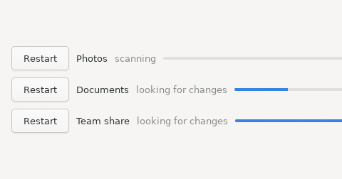</a> | Docker and colima, which can be installed by running [`setup-linux.sh`](scripts/setup-linux.sh) | Builds and runs. GTK4, started in a Docker container by running [`scripts/run-linux.sh`](scripts/run-linux.sh). |
| **FreeBSD** — `freebsd/386`, **`freebsd/amd64`**, `freebsd/arm`, **`freebsd/arm64`** | <a href="example/gtk-app">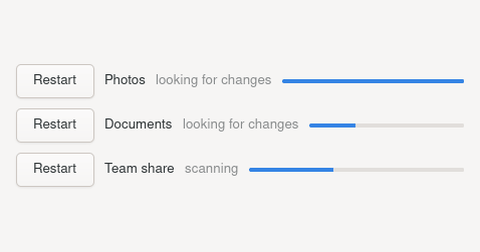</a> | qemu, which can be installed by running [`setup-freebsd.sh`](scripts/setup-freebsd.sh) | Builds and runs. GTK4, the same app as Linux, NetBSD and OpenBSD, started in a VM by running [`scripts/run-freebsd.sh`](scripts/run-freebsd.sh). |
| **OpenBSD** — `openbsd/386`, **`openbsd/amd64`**, `openbsd/arm`, **`openbsd/arm64`**, `openbsd/ppc64`, `openbsd/riscv64` | <a href="example/gtk-app">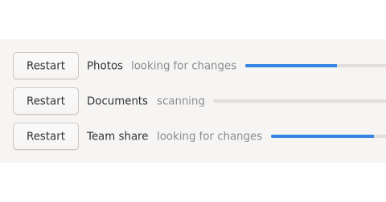</a> | qemu, which can be installed by running [`setup-openbsd.sh`](scripts/setup-openbsd.sh) | Builds and runs. GTK4, the same app as Linux, FreeBSD and NetBSD. OpenBSD ships an installer rather than a disk image, so the first run installs it, answering `autoinstall(8)` from a response file: [`scripts/run-openbsd.sh`](scripts/run-openbsd.sh). |
| **NetBSD** — `netbsd/386`, **`netbsd/amd64`**, `netbsd/arm`, **`netbsd/arm64`** | <a href="example/gtk-app">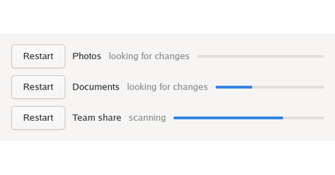</a> | qemu, which can be installed by running [`setup-netbsd.sh`](scripts/setup-netbsd.sh) | Builds and runs. GTK4, the same app as Linux, FreeBSD and OpenBSD, started in a VM by running [`scripts/run-netbsd.sh`](scripts/run-netbsd.sh). |
| **DragonFly** — **`dragonfly/amd64`** | <a href="example/gtk-app">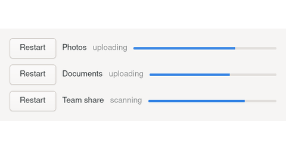</a> | qemu, which can be installed by running [`setup-dragonfly.sh`](scripts/setup-dragonfly.sh) | Builds and runs. GTK4, the same app as the other BSDs, started in a VM by running [`scripts/run-dragonfly.sh`](scripts/run-dragonfly.sh). DragonFly is x86 only, so that VM is emulated rather than virtualised: a minute to boot, and an hour to install GTK4 the first time. |
| **illumos** — **`illumos/amd64`** | <a href="example/gtk-app">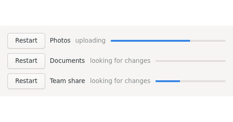</a> | qemu, which can be installed by running [`setup-illumos.sh`](scripts/setup-illumos.sh) | Builds and runs. GTK4, the same app as the BSDs, on OpenIndiana in a VM: [`scripts/run-illumos.sh --install`](scripts/run-illumos.sh) installs it, which takes about an hour because illumos is x86 only and this Mac emulates that, and `run-illumos.sh` runs it afterwards. |
| **Android** — `android/386`†, `android/amd64`†, `android/arm`†, **`android/arm64`** | <a href="example/android-app">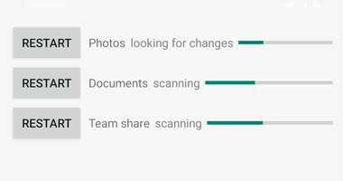</a> | the Android SDK, a JDK and Kotlin, which can be installed by running [`setup-android.sh`](scripts/setup-android.sh) | Builds and runs in the emulator, built and started by running [`scripts/run-android.sh`](scripts/run-android.sh). |
| **iOS** — `ios/amd64`†, **`ios/arm64`** | <a href="example/ios-app">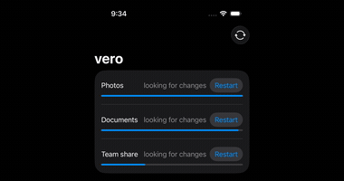</a> | Xcode and a Simulator runtime, which can be installed by running [`setup-ios.sh`](scripts/setup-ios.sh) | Builds and runs in the Simulator, not on a phone. An app may not start a program on iOS, so the worker is compiled into the app and runs on a goroutine. Built and launched by running [`scripts/run-ios.sh`](scripts/run-ios.sh). |
| **wasm**, a browser — **`js/wasm`** | <a href="example/web-app">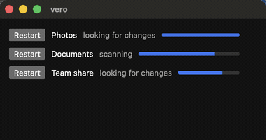</a> | a browser | Builds and runs. A page may not start a program, so the worker is compiled into the same wasm as the UI, as on iOS. Built and opened by running [`scripts/run-web.sh`](scripts/run-web.sh). |
| **wasm**, WASI — **`wasip1/wasm`** | <a href="example/wasi-app">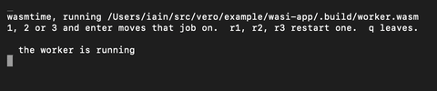</a> | wasmtime, which can be installed by running [`setup-wasm.sh`](scripts/setup-wasm.sh) | Builds and runs, as [example/wasi-app](example/wasi-app): your Go program starts `wasmtime`, which runs `worker.wasm`. It has to be a Go program, because the Python, C# and Kotlin bindings would ask `worker.wasm` to start a second copy of itself, which it cannot do in a sandbox. Note too that `worker.wasm` answers one request at a time, and can do nothing in between. |
| **Plan 9** — `plan9/386`, **`plan9/amd64`**, `plan9/arm` | <a href="scripts/run-plan9.sh">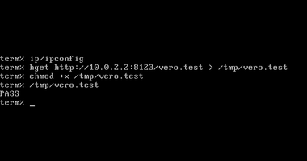</a> | qemu, which can be installed by running [`setup-plan9.sh`](scripts/setup-plan9.sh) | Builds, and the tests pass on 9front under qemu: [`scripts/run-plan9.sh`](scripts/run-plan9.sh) boots it and runs them. No frontend - Plan 9 draws through libdraw, and we have not built a UI using libdraw at this stage. |
| **Solaris** — **`solaris/amd64`** | — | — | Builds by running [`scripts/build-all.sh`](scripts/build-all.sh), and does not run. Solaris needs an Oracle licence to download, and runs on x86, which this Mac emulates rather than virtualises. |
| **AIX** — **`aix/ppc64`** | — | — | Builds by running [`scripts/build-all.sh`](scripts/build-all.sh), and does not run. AIX needs IBM hardware, and there is no public image to boot. |

## Build and run the macOS example

The example is a menu bar app driving the Go worker (main.go below):

```bash
git clone https://github.com/imclaren/vero && cd vero
cd example/menubar-app && ./build.sh
./.build/debug/MenuBarExample
```

Look for the icon in the menu bar. The source is available at
[example/menubar-app](example/menubar-app).

## Create a vero macOS app in 5 minutes

### 1. Build the go worker

Get vero:

```bash
mkdir -p ~/vero-example/macos-app && cd ~/vero-example/macos-app
go mod init macos-app
go get github.com/imclaren/vero
```

Create `main.go` (file also available at
[example/worker/main.go](example/worker/main.go)):

```go
// Command worker is the logic half of the example: the part you would write.
//
// The flags come from vero.WorkerOptions: -json puts the event stream on
// stdout, -quiet silences the log, and -version is what the frontend asks
// before replacing the copy of this it has on disk.
package main

import (
	"flag"
	"fmt"
	"math/rand"
	"slices"
	"time"

	"github.com/imclaren/vero"
)

// version has to increase on every release, so the frontend can tell which
// of two copies is newer.
var version = "0.11.0"

type Job struct {
	ID       int    `json:"id"`
	Name     string `json:"name"`
	Phase    string `json:"phase"`
	Progress int    `json:"progress"`
}

// Key is how an id in a request finds one job.
func (j Job) Key() int { return j.ID }

func (j *Job) Restart() { j.Phase, j.Progress = "waiting", 0 }

type Status struct {
	Jobs    []Job  `json:"jobs"`
	Working bool   `json:"working"`
	Since   string `json:"since"`
}

func working(s *Status) {
	s.Working = slices.ContainsFunc(s.Jobs, func(j Job) bool {
		return j.Phase != "waiting" && j.Phase != "done"
	})
}

func main() {
	var opts vero.WorkerOptions
	opts.Version = version
	opts.RegisterFlags(flag.CommandLine)
	flag.Parse()
	opts.PrintVersionAndExit()

	w := vero.NewWorker(opts)

	// The state.  vero watches it and sends it to the frontend whenever its
	// JSON changes, which is how the frontend tracks status without asking.
	// Each handler below replies with it as well.
	state := vero.NewState(w, Status{
		Jobs: []Job{
			{ID: 1, Name: "Photos", Phase: "waiting"},
			{ID: 2, Name: "Documents", Phase: "waiting"},
			{ID: 3, Name: "Team share", Phase: "waiting"},
		},
		Since: time.Now().Format("15:04:05"),
	})

	go work(w, state)

	// Update handles a request with no accompanying data.  "status" returns
	// the state.
	vero.Update(state, "status", func(*Status) error { return nil })

	// UpdateWith handles a request with accompanying data.  "restartJob"
	// takes the id of the job to restart.
	vero.UpdateWith(state, "restartJob", func(s *Status, req vero.ID[int]) error {
		if err := vero.Edit(s.Jobs, req.ID, (*Job).Restart); err != nil {
			return fmt.Errorf("no job with id %d", req.ID)
		}
		working(s)
		return nil
	})

	if err := w.Serve(); err != nil {
		w.Log("stopped: %v", err)
	}
}

// work is the business logic - we have added random state changes to
// demonstrate how this works.
func work(w *vero.Worker, state *vero.State[Status]) {
	phases := []string{"looking for changes", "scanning", "uploading", "done"}
	for {
		time.Sleep(time.Duration(200+rand.Intn(400)) * time.Millisecond)

		var name, phase, before string
		state.Do(func(s *Status) {
			j := &s.Jobs[rand.Intn(len(s.Jobs))]
			before = j.Phase
			switch i := slices.Index(phases, j.Phase); {
			case j.Phase == "waiting" || j.Phase == "done":
				j.Phase, j.Progress = phases[0], 0
			case j.Progress < 100:
				j.Progress = min(j.Progress+20+rand.Intn(30), 100)
			case i+1 < len(phases):
				j.Phase, j.Progress = phases[i+1], 0
			}
			name, phase = j.Name, j.Phase
			working(s)
		})

		if phase != before {
			w.Log("%s: %s", name, phase)
		}
	}
}
```

Build it for both architectures (old Intel Macs and new Apple Silicon Macs) and join them into one binary, so the app runs
on either. `lipo` comes with Xcode:

```bash
GOOS=darwin GOARCH=amd64 go build -o worker-amd64 . && \
GOOS=darwin GOARCH=arm64 go build -o worker-arm64 . && \
lipo -create worker-amd64 worker-arm64 -output worker
```

### 2. Create a new macOS SwiftUI Xcode project

In Xcode, File -> New -> Project -> macOS -> App, with Interface set to
SwiftUI. Then:

- File -> Add Package Dependencies... -> `https://github.com/imclaren/vero`
- drag `~/vero-example/macos-app/worker` into the project, ticking your app
  under **Add to targets**

### 3. Add the app to the project

Create `ExampleApp.swift` (file also available at
[example/menubar-app/Sources/MenuBarExample/ExampleApp.swift](example/menubar-app/Sources/MenuBarExample/ExampleApp.swift)):

```swift
import SwiftUI
import Vero

// What the worker pushes: the same shape as Status and Job in main.go.
struct Job: Decodable, Identifiable {
    let id: Int
    let name: String
    let phase: String
    let progress: Int
}

struct Status: Decodable {
    let jobs: [Job]
    let working: Bool
    let since: String
}

// One of these per handler on the worker. The name routes the request -
// "restartJob" is the vero.UpdateWith above - and Reply says what comes back,
// so nothing has to guess at it.
struct RestartJob: NamedRequest {
    static let name = "restartJob"
    typealias Reply = Status
    let id: Int
}

@main
struct ExampleApp: App {
    // The worker, the last state it pushed, and the reason it could not start
    // if it did not: everything a view needs to draw, created once, here.
    @StateObject private var vero = VeroModel<Status>(
        bundledWorker: "worker", directoryName: "Example/bin")

    var body: some Scene {
        MenuBarExtra {
            VStack(spacing: 10) {
                ForEach(vero.state?.jobs ?? []) { job in
                    HStack(spacing: 10) {
                        // The press. This goes to the "restartJob" handler in
                        // main.go. There is no reply to deal with here,
                        // because the worker pushes the new state, and that
                        // is what redraws the row.
                        Button("Restart") { vero.call(RestartJob(id: job.id)) }
                        Text(job.name)
                        Text(job.phase).foregroundStyle(.secondary)
                        ProgressView(value: Double(job.progress) / 100)
                    }
                }
            }
            .frame(width: 460)
            .padding(16)
        } label: {
            // Pushed as well, so the icon spins while the worker is busy
            // without anything here asking it whether it is.
            Image(systemName: vero.state?.working == true
                  ? "arrow.triangle.2.circlepath"
                  : "checkmark.circle")
        }
        .menuBarExtraStyle(.window)
    }
}
```

Delete the `ContentView.swift` and `<YourApp>App.swift` that Xcode generated:
`ExampleApp.swift` is the `@main` entry point.

### 4. Run it

Press Cmd-R in Xcode. The icon appears in the menu bar, and spins while the
worker has jobs in flight. Click the menu bar icon to see progress changes.
Click the button on a row to restart that job.

## Build and run the example on all platforms using your Mac

[`./scripts/setup.sh`](scripts/setup.sh) installs the build prerequisites for
all platforms. Only two things are not installed for you using this script:
Xcode, which comes from the App Store, and a Windows ISO, which Microsoft
will not serve to a script - download it from
[https://www.microsoft.com/en-us/software-download/windows11arm64](https://www.microsoft.com/en-us/software-download/windows11arm64)
and put it in `~/vm/vero-windows/`.

[`./scripts/run.sh`](scripts/run.sh) then builds and opens the example on macOS (natively), and Linux
and Windows (by showing the app in VMs) side by side.

All targets in **bold** (e.g. `darwin/arm64`), other than `android/arm64`,
`ios/arm64` and `js/wasm`, can be built by running
[`./scripts/build-all.sh`](scripts/build-all.sh).
[`android/arm64`](example/android-app/build.sh),
[`ios/arm64`](example/ios-app/build.sh) and
[`js/wasm`](example/web-app/build.sh) have their own build scripts because
they do not build a standalone worker. To build targets not in bold, specify
them when building: `TARGETS=plan9/386 ./scripts/build-all.sh`.

† targets need a C toolchain: either an NDK for the three Androids that are
not `arm64`, or the Simulator SDK for `ios/amd64`. The other 43 targets only
need Go.

## Licence

MIT
